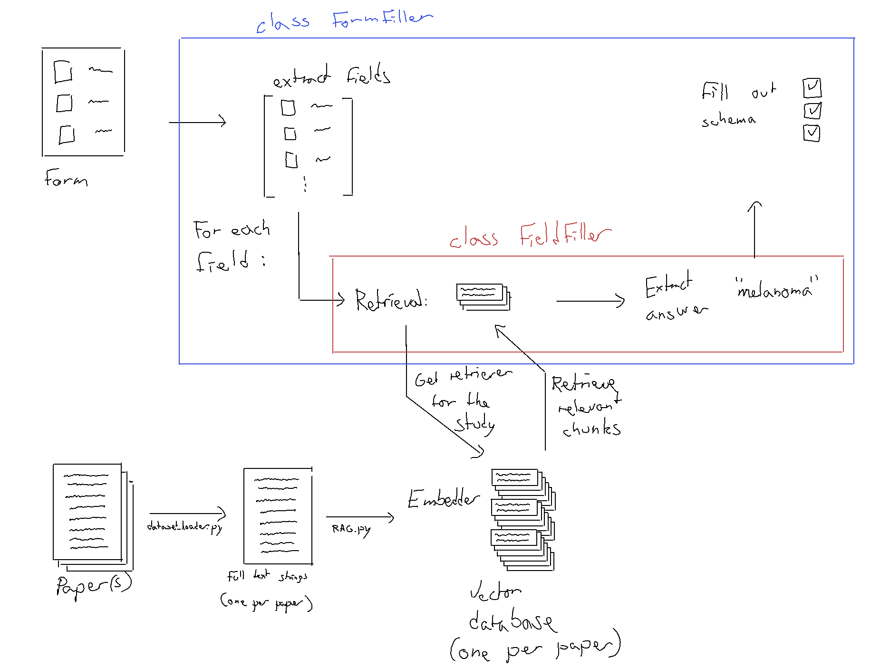
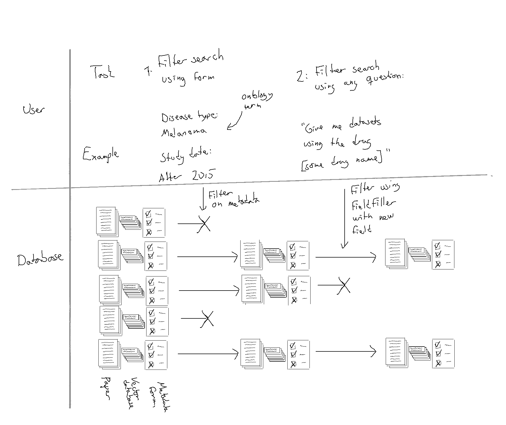

# profiler pipeline

## Code pipeline:

## User interaction

Possible user interaction setup:
User can use either metadataform for write any question, essentially generating a new field for the form.
(the latter way will require much more compute at inference time, so restricting the search as much as possible using available metadata _first_ will be recommended)

